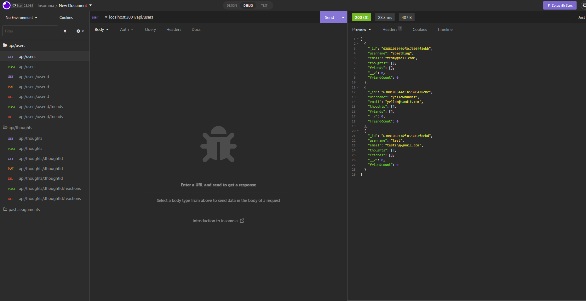
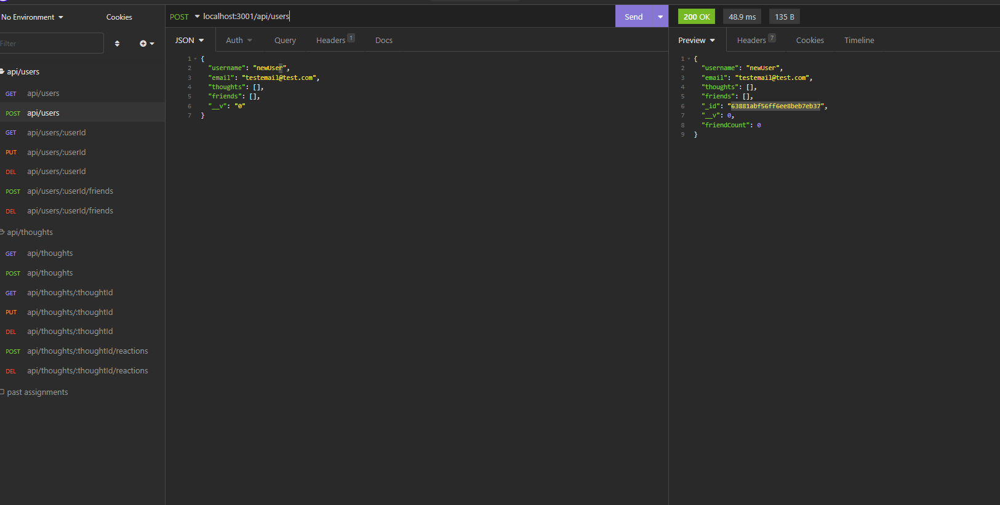
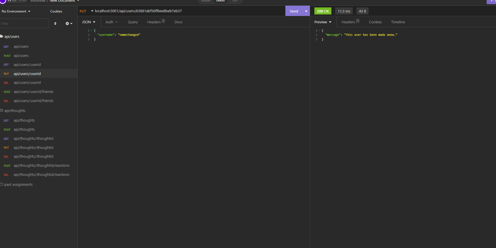
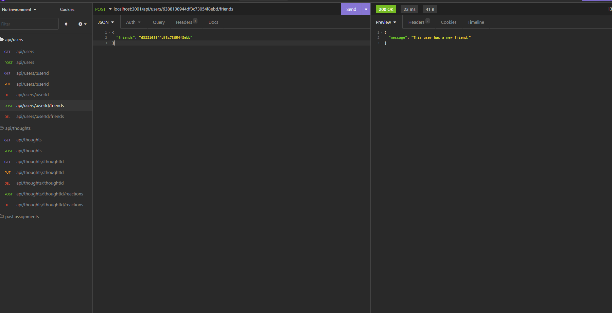
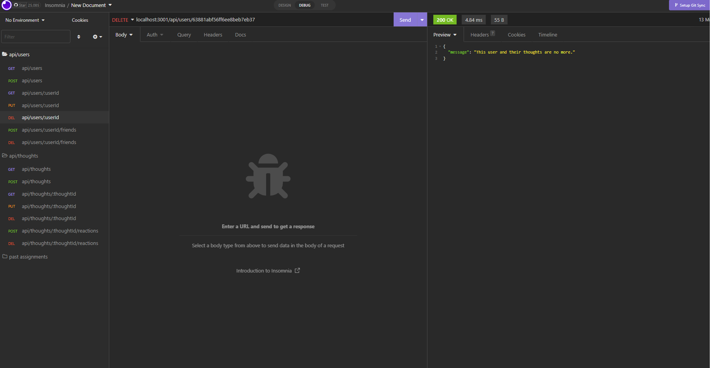
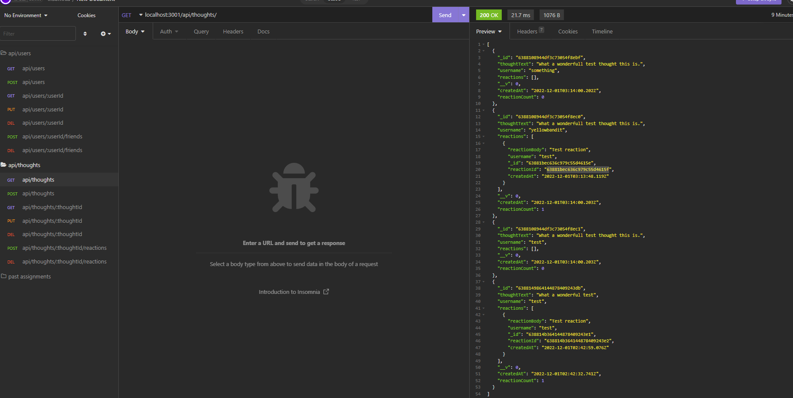
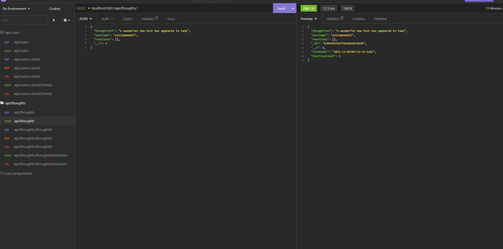
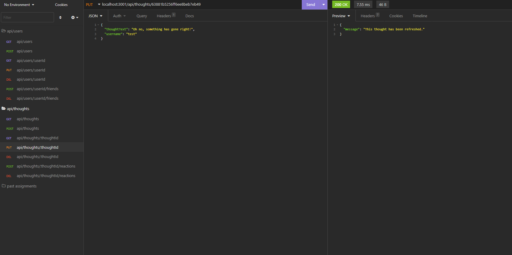

# Social Network API 

## Description 

This is a social network API. It allows a user to create a new account, update the account, add and remove friends, as well as share, update and delete thoughts, or reactions to the thoughts.
 
## Table of Contents
 
- [Installation](#installation)
- [Usage](#usage) 

##  Installation 

Install the needed modules through `npm i`
Run the seeder `npm run seed`
Start the application `npm start`

View in your testing application, such as Insomnia or Postman.

## Usage 

https://drive.google.com/file/d/1ZG57vPCZAae5WfAoG4z6cgY_W_qiNY3m/view

 
 
 

 
 
 
 

Currently there are issues with deleting thoughts and removing reactions.
When a thought gets deleted, the server crashes. The thought is still deleted.
When a reaction is attempted to be removed, it is not found.